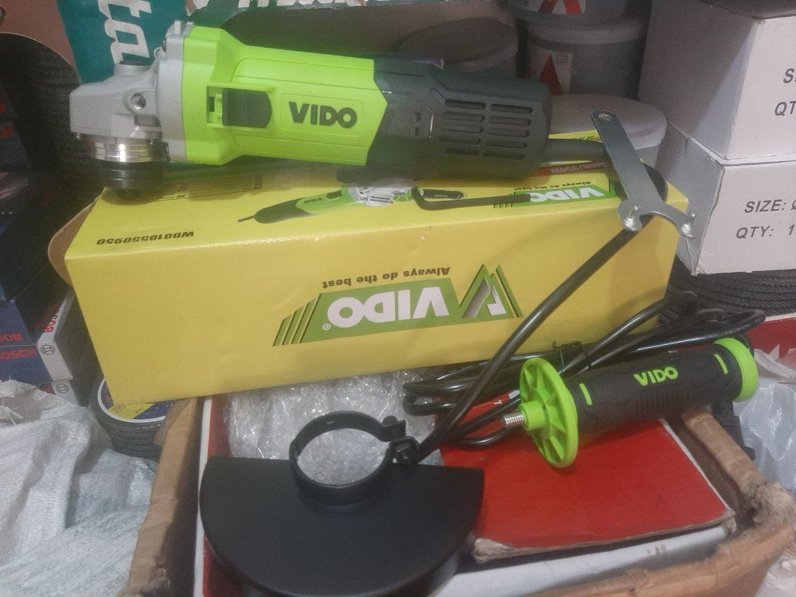
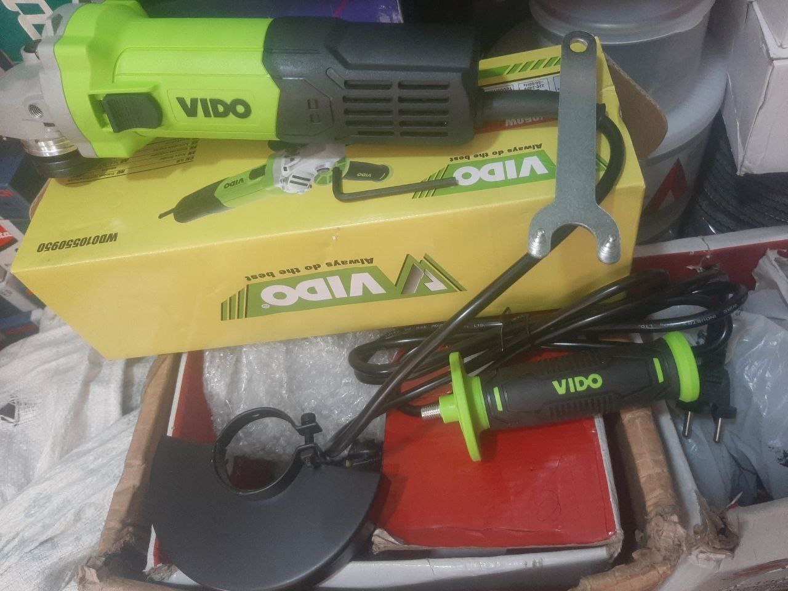
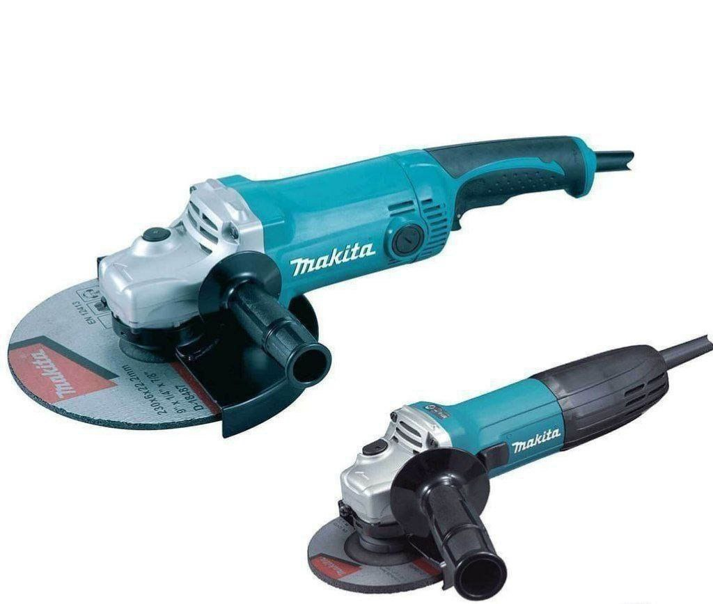
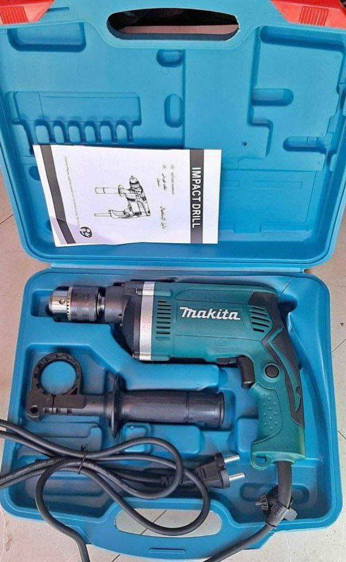
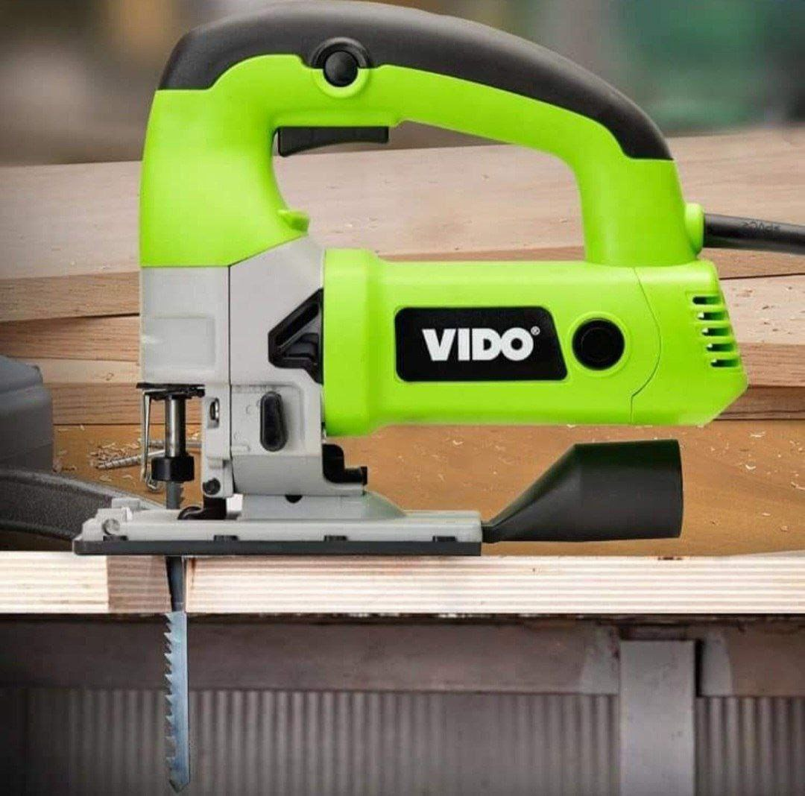

# 1. Vido Grinder - Unleash the Grinding Power! 💪☕

Enhance your grinding experience with the Vido Grinder – your perfect companion for turning coffee beans into a delightful cup of goodness! Whether you prefer a small or big grind, Vido's got the power. ☕🔧

## Models and Prices:

- **Small Vido Grinder:** 4999 birr
- **Big Vido Grinder:** 7900 birr

## Specifications:

- **Description:** The Vido Grinder is designed for precision grinding.
- **Price:** 
  - Small: 4999 birr
  - Big: 7900 birr

### 🚚 **Free Delivery:**
Enjoy hassle-free delivery right to your doorstep. 🌐🎁

📞 **Contact Us:**
- Call us at 0954938537

👉 **For More Deals and Updates, Join our Telegram Channel:**
[LiYu Tools Telegram Channel](https://t.me/liyutools)

Grind your way to the perfect cup with Vido! ☕🌞
# 2. Makita and Bosch Grinders - Grind with Power! 💪🔧

Explore the world of precision grinding with Makita and Bosch Grinders – the ultimate choice for all your grinding needs! From light-duty to heavy-duty tasks, we've got the power you need. 🔩🌪️

## Models and Prices:

- **Makita 840W Grinder:** 3500 birr
- **Bosch 1000W Grinder:** 3700 birr
- **Makita 2400W Grinder:** 5990 birr

### 🚚 **Free Delivery:**
Take advantage of our free delivery service for added convenience. 🌐🎁

👉 **For More Deals and Updates, Join our Telegram Channel:**
[LiYu Tools Telegram Channel](https://t.me/liyutools)

📞 **Contact Us:**
- Call us at 0954938537

Grind with confidence and power! 🔧💥

# 3. Makita Normal Impact Drill - Power Unleashed! 🔩💨

Introducing the Makita Normal Impact Drill, where power meets precision for all your drilling needs! Whether you're a professional or a DIY enthusiast, this drill is designed to make your projects a breeze. ⚙️🛠️

## Specifications:

- **Power:** 710W ✅
- **Versatility:** Ideal for drilling, fastening, and more.
- **Reversible:** Yes - for flexibility in use.
- **Metal Chuck:** Durable and designed for maximum grip.

## Pricing:

- **Price:** 3300 birr ✅

### 🚚 **Free Delivery:**
Enjoy the convenience of free delivery right to your doorstep. 🌐🎁

📞 **Contact Us:**
- Call us at 0954938537

👉 **For More Deals and Updates, Join our Telegram Channel:**
[LiYu Tools Telegram Channel](https://t.me/liyutools)

Empower your projects with the Makita Normal Impact Drill! 🔧💥

# 4. Vido Jigsaw - Precision Cutting Made Easy! 🪚✨

Introducing the Vido Jigsaw, where precision meets power for all your cutting endeavors! Whether you're into woodworking or metal crafting, this jigsaw is designed to make your cuts smooth and accurate. ⚙️🔪

## Specifications:

- **Input Power:** 650W
- **No-load Speed:** 500-2600 min
- **Frequency:** 50/60 Hz
- **Maximum Cutting Depth:**
  - Wood: 80mm
  - Metal: 8mm

## Pricing:

- **Price:** 6500 birr

📞 **Contact Us:**
- Call us at 0954938537

👉 **For More Deals and Updates, Join our Telegram Channel:**
[LiYu Tools Telegram Channel](https://t.me/liyutools)

Experience precision cutting with the Vido Jigsaw! 

